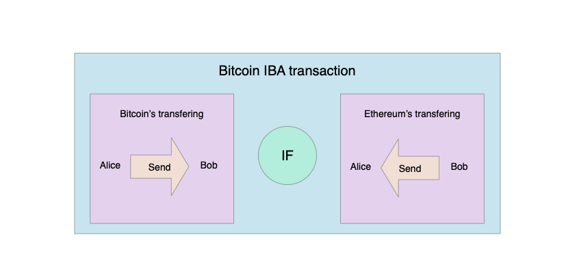
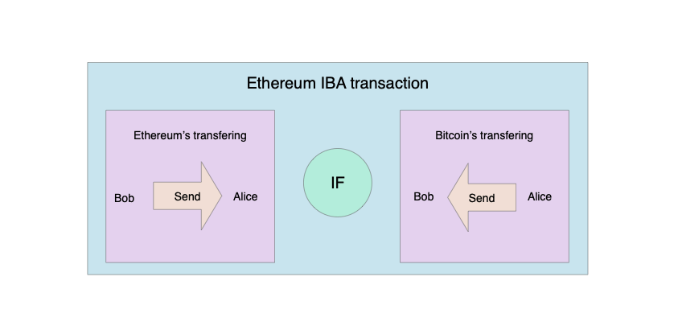

# Inter-Blockchain Api Protocol description

## Purpose
Build a protocol for blockchains to communicate with each other in the secure, trustless and transparent way.
IBA provides standatized way how to connect to the whole "Internet of Blockchains" and how to communicate with each other directly.

## Simple use case

Lets consider two separate blockchains for example Ethereum and Bitcoin. These blockchains want to have an ability to share their assets with each other, in our case assets are coins. And of course we want to do it in a secure way.
We need to have an ability to create a new transaction which will transfer Bitcoin coins to the Ethereum one and vice-versa. But we conside an exchange from Bitcoin to Ethereum, so `user1` which will transfer his Bitcoin coins to `user2` will get Ethereum coins from `user2` and `user2` will receive Bitcoin coins.
## Problem statement
To do this we need to solve the folowing problems:
1. **Blockchain connection** - we need to get possibility to connect one blockchain network to another one, so as result we need to get a decentralized connection with the two networks. In our case we do not consider to provide comunication with blockchains throught the another one, we want to avoid this uneeded layer.
2. **Blockchain api standartization** - every blockchain has unique functionality with the unique interface, even for the coin transfering we can have two different functions with the different agrument list, argument type etc. So each blockchain should certainly know how to invoke the fucntionality from the another one. We need to simplify it and provide and standartized scheme how to call an any available function from the any blockchain.
3. **Interaction's security providing** - we need to have a guarantee that interaction between blockchains is secure. every blockchain should know or should have possibility to validate that an action which we have been executed in the another blockchain has been successfully applied or not.

## Inter-Blockchain connection layer

To implement an Inter-Blockchain connection layer we will use a [libp2p](https://libp2p.io) library. With the usage of the libp2p library we can unify the way how each blockchain network will interact with each other and also simplify the implementation process.s

// TODO: define a specific protocol stack with from libp2p library.

## Blockchain api standartization

// TODO:

## IBA message passing

Lets consider example which we have already discussed before with the two blockchain networks: Bitcoin and Ethereum. `Alice` wants to exchange Bitcoin's to the Ethereum's with `Bob` and also to do that in the secure way but without any thirdparties. Lets decribe what `Alice` and `Bob` need to do with the usage of the `IBA protocol`:
1. Alice needs to create a new `IBA transaction` and broadcast through the Bitcoin network in the same manner like it is going with the original Bitcoin's transaction. Transaction should contains specified amount of the Bitcoin transferring from `Alice` to `Bob` and specified amount of the Ethereum trasferring amount from `Bob` to `Alice`.  Coin transferring from `Alice` to `Bob` will be done only if coin transferring from `Bob` to `Alice` will be in place.

2. `Bob` can create the same `IBA transaction` and broadcast through the Ethereum network.

3. At this step `Alice` and `Bob` to retrieve their coins from the Ethereum blockchain and Bitcoin blockchain respectively need to wait until these transactions will be included into the Ethereum and Bitcoin blokchains and have been finalized. As currently Bitcoin and Ethereum has a probabilistic finality so we can follow the common flow how we consider transactions to be finalized in the network. For the Bitcoin and Ethereum we need to wait until 6 blocks will be mined behind the block which contain our transaction.

## IBA transaction structure
